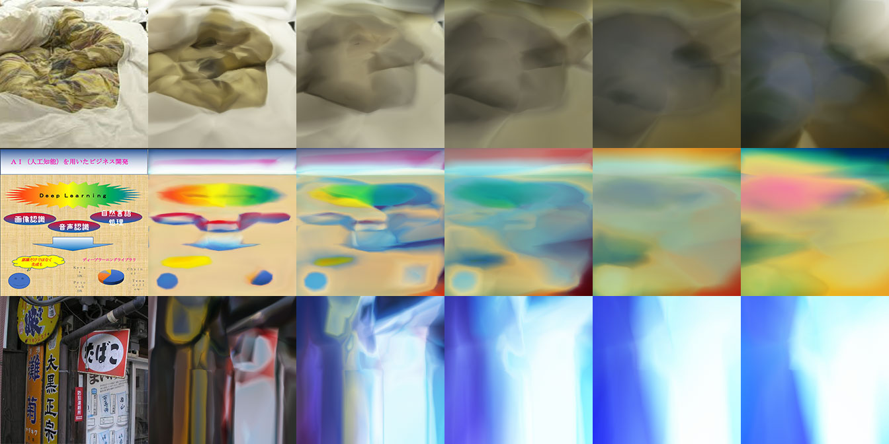
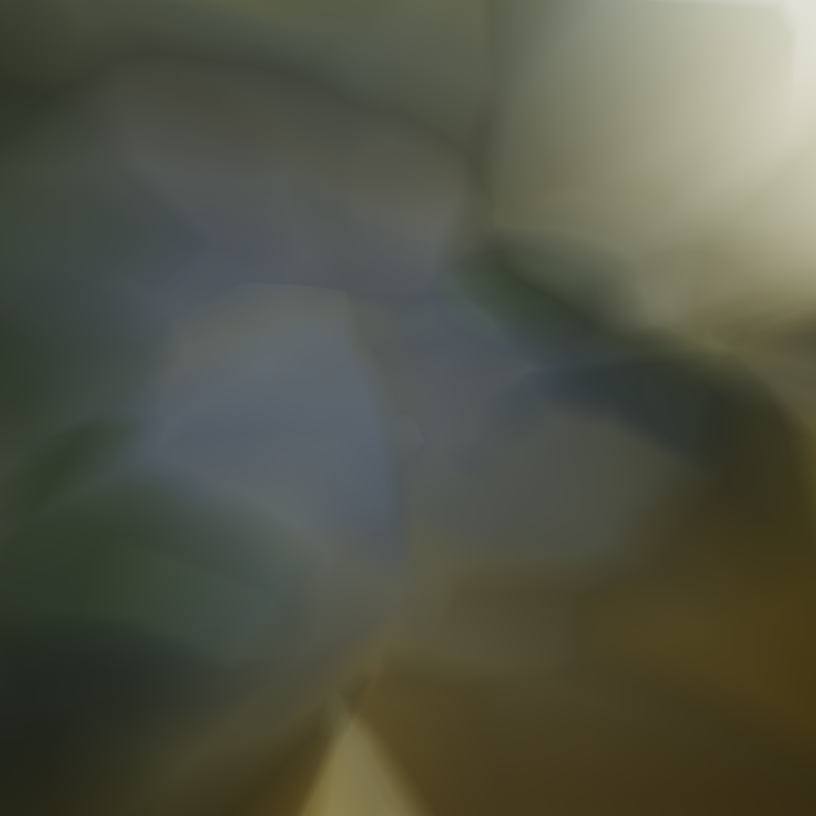

# KerasPainter - Image Regression in Keras

Giving value to worthless designs using neural networks.

Here is full code example: https://github.com/smurakami/KerasPainter/blob/master/KerasPainter.ipynb

## Source "worthless" Images

## Learning Process

## Example Results

